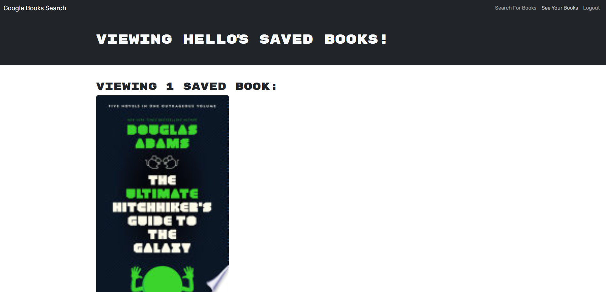

# MERN Book Search Engine

  ## Description
  This is a book search engine web app that has been refactored from a RESTful API to MERN. It allows the user to search for books and save those that interest them.

  ## Table of Contents
  [Installation](#installation)

  [Usage](#usage)

  [Contributing](#contributing)

  [Tests](#tests)

  [Questions](#questions)

  ## Installation
  The easiest way to access the site is to go to https://mern-book-search-engine-f8nm.onrender.com/ (wait around 30 seconds for it to boot up).

  Otherwise, clone the repo to you device, cd into "Develop", and run "npm run render-build". After that, run "npm run develop" to run the site. Make sure MongoDB is on your device.

  ## Usage
  While logged out, you can search for books using keywords in the search bar. If you wish to save books, you need to log in/sign up using the button in the upper right. Once you're logged in, you can click the buttons on the bottom of book descriptions to save your books. These books can be viewed by clicking the See Your Books tab up top. Books can be unsaved by clicking the delete button at the bottom. Users are automatically logged out after a while.

  ## Contributing
  Feel free to add to this and clean up its look.

  ## Tests
  Make sure all the buttons and logins work.

  ## Questions
  My GitHub: https://github.com/ElBoyTM

  My email: nszalenski@gmail.com
